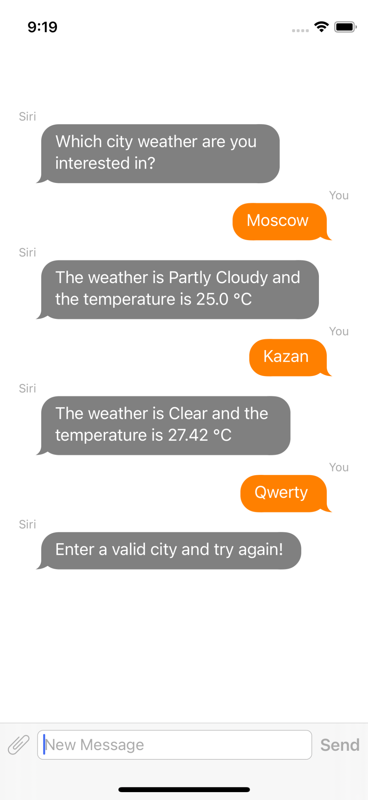

# Weather Bot

Bot give a weather forecast for a certain city. I use 2 different APIs coming from 2 services:
    - Recast.AI an API will provide you the Artificial Intelligence brick for your bot
    - Dark Sky an open source API that will help you recover the weather for a given latitude and longitude. (Formerly Forecast.IO)
    - Pod JSQMessagesViewController an elegant messages UI library for iOS.

